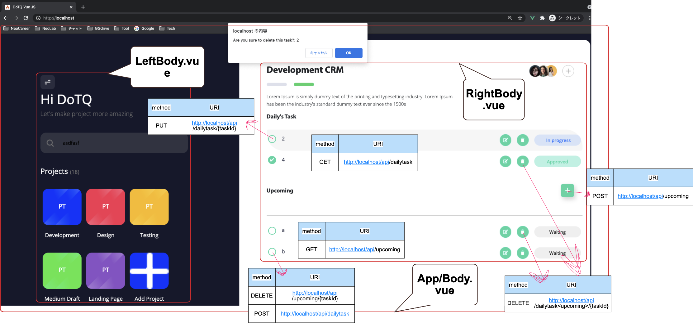

# docker-laravel 🐳



[](https://github.com/tquangdo/vue2-laravel8-crud-crm-app/issues/new)

## Introduction

Build a simple laravel development environment with docker-compose.

## Usage

```bash
$ git clone git@github.com:ucan-lab/docker-laravel.git
$ cd docker-laravel
$ make create-project # Install the latest Laravel project
$ make install-recommend-packages # Not required
```

http://localhost

Read this [Makefile](https://github.com/ucan-lab/docker-laravel/blob/master/Makefile).

## Tips

Read this [Wiki](https://github.com/ucan-lab/docker-laravel/wiki).

## Container structure

```bash
├── app
├── web
└── db
```

### app container

- Base image
  - [php](https://hub.docker.com/_/php):8.0-fpm-buster
  - [composer](https://hub.docker.com/_/composer):2.0

### web container

- Base image
  - [nginx](https://hub.docker.com/_/nginx):1.18-alpine
  - [node](https://hub.docker.com/_/node):14.2-alpine

### db container

- Base image
  - [mysql](https://hub.docker.com/_/mysql):8.0

#### Persistent MySQL Storage

By default, the [named volume](https://docs.docker.com/compose/compose-file/#volumes) is mounted, so MySQL data remains even if the container is destroyed.
If you want to delete MySQL data intentionally, execute the following command.

```bash
$ docker-compose down -v && docker-compose up
```
