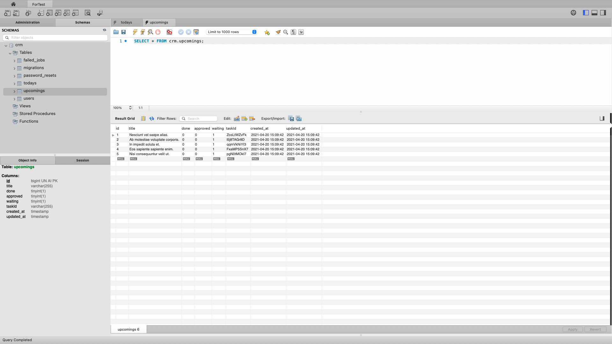

# deploy

## Vue

- `docker-compose exec app bash`
- `[app] $ composer require laravel/ui`
- `[app] $ php artisan ui vue`
- `cd backend`
- `backend % npm install && npm run watch` (MUST)

## Laravel

1. By Docker
- `docker-compose up -d`
- in browser accesss to "localhost" (MUST)
2. By Laravel artisan
- `backend % php artisan serve`
- in browser accesss to "localhost:8000"
- => ERR: `SQLSTATE[HY000] [2054] The server requested authentication method unknown to the client (SQL: query)`

## DB

### connect by tool (MySQLWorkbench)
- `user: root & pw: secret`
### migration
 (MUST)
- `docker-compose exec app bash`
- `php artisan migrate`

## MVC

- `php artisan make:model Upcoming/Today -m`
>KO can `php artisan make:migration create_upcomings/todays_table`
- `php artisan make:seeder UpcomingSeeder/TodaySeeder`
- `php artisan db:seed --class=UpcomingSeeder/TodaySeeder`
- `php artisan make:resource UpcomingResource/TodayTaskResource`
